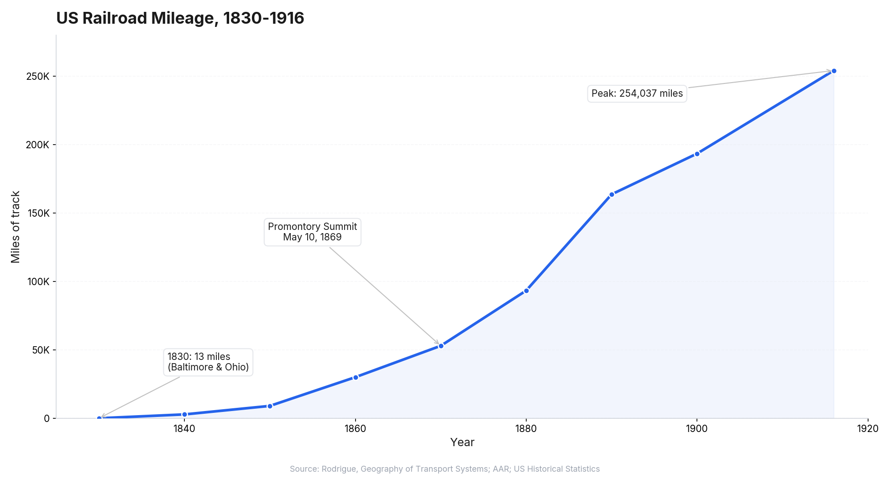
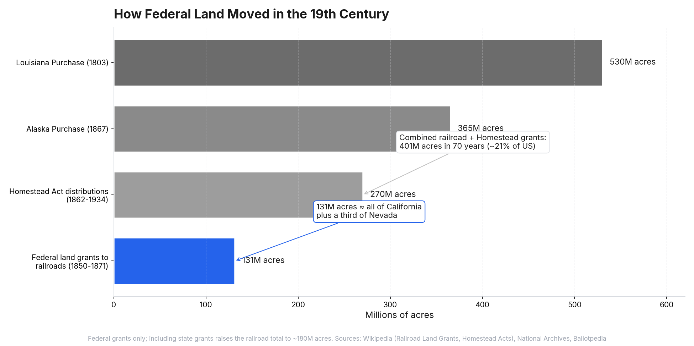
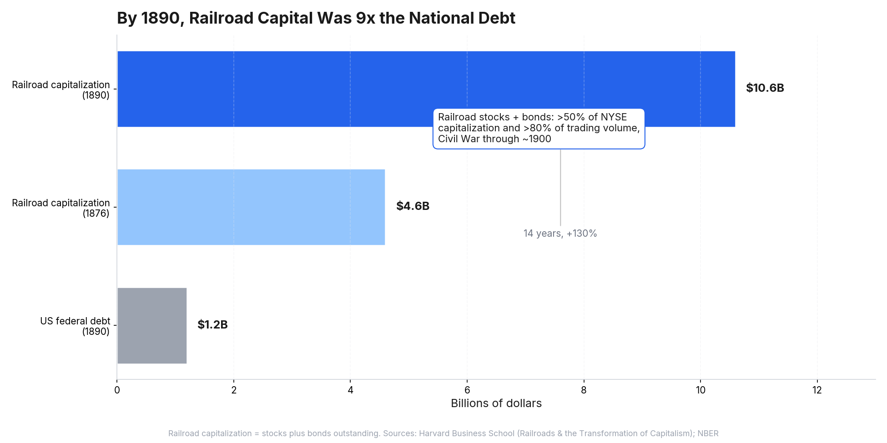
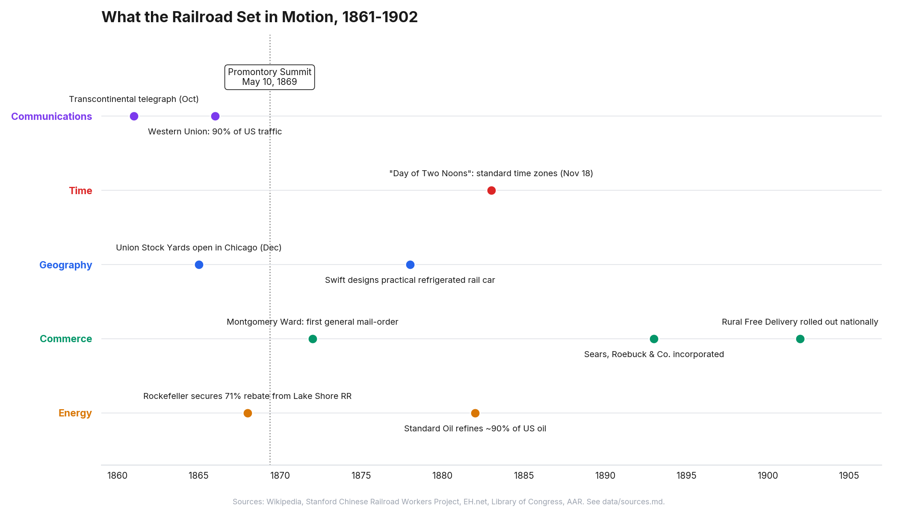
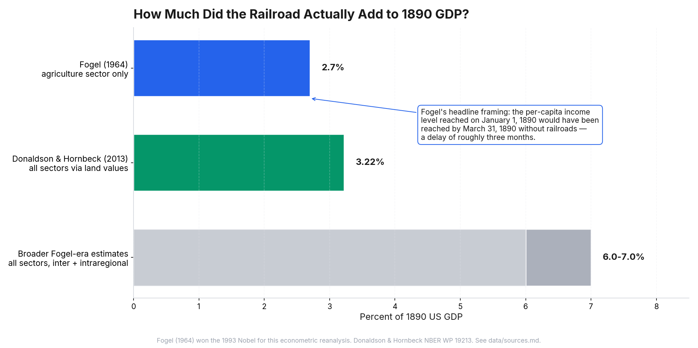

# Railroads & the American Frontier

> *Part 1 of "The Beginning of the Beginning" series*

> The transcontinental railroad was completed on May 10, 1869, when a golden spike was driven at Promontory Summit, Utah. Forty-two years earlier, the first American railroad was a 13-mile stretch in Maryland. By 1890, the United States had 163,000 miles of track. No infrastructure project before or since has transformed a continent this fast.

---

## Thesis

The railroad wasn't primarily a transportation technology. It was an *optionality engine*. It made an entire continent of unknown possibility accessible, and then people, markets, and institutions figured out what to do with it. The most important consequences of the railroad — time zones, Chicago, mail-order retail, the telegraph network, the oil industry's distribution system — were not in any railroad company's business plan. Understanding how this pattern works (build the infrastructure → unexpected value emerges) is essential context for understanding what happens next with space.

---

## Section Outline

### 1. The Technical Unlock

The railroad looks like a 19th-century invention. It wasn't. Thomas Newcomen's atmospheric engine was pumping water out of Cornish tin mines in 1712. James Watt's separate-condenser improvement, the one that made steam genuinely efficient, arrived in the 1760s. Richard Trevithick ran the first locomotive on rails in 1804. The Liverpool and Manchester opened with George Stephenson's *Rocket* in 1829. By the time the Baltimore and Ohio was chartered in 1827 and the Charleston and Hamburg started the first scheduled American steam passenger service in 1830, the underlying technology was well over a century old.

Why did the explosion happen then, and not earlier or later? Three things converged. First, iron production had matured enough to make rails affordable at scale. Second, the engines themselves had been miniaturized and powered up to the point where they could pull useful loads at useful speeds. Third, and this is the part the technology histories usually skip, the political imagination caught up. State legislatures started chartering railroad companies the way they had chartered turnpikes and canals, with land grants and stock subscriptions. The Erie Canal had opened in 1825 and reshaped commerce on the eastern seaboard. The B&O charter followed two years later.

What came next wasn't a single great invention but a series of standardization choices that compounded. Standard gauge of 4 feet 8.5 inches was effectively mandated for the transcontinental by the Pacific Railroad Act of 1863; adoption across the rest of the country took until 1886. Steel rails replaced iron through the 1870s and 1880s as the Bessemer process scaled, extending track life from a few years to a few decades. George Westinghouse patented the air brake in 1869; it took until the Railroad Safety Appliance Act of 1893 to make it mandatory. Each unspectacular alone. Together they turned the curve in the chart from a novelty into a continental network.

### 2. The Government's Bet

Two pieces of legislation passed Congress in 1862. The Homestead Act, signed by Lincoln on May 20, offered 160 acres of public land to anyone who would farm it for five years. The Pacific Railway Act, signed six weeks later on July 1, gave the Union Pacific and Central Pacific railroads alternating sections of land along their tracks plus 30-year, 6% federal bonds at $16,000 to $48,000 per mile depending on terrain. The 1864 follow-up doubled both the land grants and the bond rates.

The genius of the structure was that it didn't require the government to spend much cash. The federal government had something it considered abundant — public land, much of it taken from Indigenous nations through treaty and force — and something it didn't have, which was money to build a transcontinental railroad in the middle of a civil war. Land became the currency.

The mechanism was clever in a second way. Railroads were given alternate sections in a "checkerboard" pattern; the government kept the sections in between. Land near a railroad was worth a multiple of what land in the middle of the prairie was worth, so the act of building the railroad turned the government's retained sections into something settlers would pay for. A railroad got land it could sell to finance construction. Settlers bought adjacent Homestead Act land at a discount. The government partly recouped its giveaway through sales of the sections it kept.

The combined scale of the two programs is the thing that's hard to grasp. By 1934, the Homestead Act had distributed about 270 million acres across roughly 1.6 million claims. By 1871, when the federal land-grant program ended, railroads had received about 131 million acres in federal grants, or 180 million counting state grants on top. Together that is roughly 401 million acres redistributed in seventy years, about 21 percent of the continental United States.

For comparison, the Louisiana Purchase added 530 million acres. The Alaska Purchase added 365. The federal government, in a coordinated supply-and-demand bet conducted under the cover of a civil war, redistributed an area larger than Alaska to private hands as deliberate policy. It was the largest peacetime program of land redistribution in American history, and it was structured as infrastructure subsidy.

### 3. The Money

If the railroad was an optionality engine on the land, it was a cash machine on Wall Street. Railroad stocks and bonds made up more than half of the New York Stock Exchange's capitalization and more than 80 percent of its trading volume from the Civil War through about 1900. Until Standard Oil overtook it in 1884, the largest corporation in the United States was always a railroad. The first widely-traded American stock was the Vermont Central Railroad, in 1845.

The numbers were enormous in absolute terms too. By 1890, railroad stocks plus bonds outstanding had grown to about $10.6 billion, up from $4.6 billion in 1876. That single sector was capitalized at roughly nine times the federal national debt at the time. To raise that much capital, railroads pulled together every financial instrument the era had — domestic equity, corporate bonds, municipal bonds, foreign capital, and direct federal subsidy — and invented a few new ones in the process.

About forty percent of that 1890 figure, by one careful estimate, was "watered." Watered stock was the practice of issuing shares not against actual track or rolling stock but against expected earnings, against corporate goodwill, or against nothing at all. A railroad whose actual physical infrastructure cost $50 million might be capitalized at $90 million, with the difference handed out to insiders. The water is what made the wealth concentration possible. Vanderbilt, Gould, Stanford, Huntington, Harriman — those names were not built on what the railroad earned moving freight. They were built on the stock that could be issued and sold against the railroad's existence.

The cleanest case study is Crédit Mobilier. The Union Pacific's insiders set up a separate construction company to build the railroad and then made sure it billed the railroad for $94 million worth of work that actually cost $50 million. The $44 million difference flowed to the insiders. Some of the discounted shares of the construction company were then handed to members of Congress to buy political protection. The scheme was exposed by the New York Sun in September 1872; House censure followed in February 1873; the implicated names included a future president (James Garfield), the Speaker of the House (James Blaine), and the sitting Vice President (Schuyler Colfax). Nothing of consequence happened to most of them.

The boom was not infinite. On September 18, 1873, Jay Cooke & Company failed because it couldn't sell the Northern Pacific bonds it had committed to underwrite. Cooke's collapse triggered the Panic of 1873, which kicked off what later economists would call the Long Depression. The proximate cause was a single railroad's bond issuance failing. The deeper cause was that too much capital had been bet on too many railroads built too quickly.

The legislative response took fifteen years to arrive. The Interstate Commerce Act of 1887 created the first federal regulatory agency, the Interstate Commerce Commission, specifically to police railroad rates. The Sherman Antitrust Act of 1890 outlawed combinations in restraint of trade. Both laws were written, in their bones, against the railroads. The infrastructure that built the modern American economy also built the modern American regulatory state.

### 4. Who Built It

The Central Pacific's trackbed through the Sierra Nevada was built almost entirely by Chinese workers. Estimates of the workforce vary between roughly 10,000 and 15,000 at construction peaks; perhaps 20,000 in total cycled through between 1865 and 1869. They were at one point about 90 percent of the Central Pacific's workforce. The Union Pacific, building west from Omaha, drew its labor mostly from Irish immigrants and Civil War veterans.

The work was brutal in a way that requires specifics. Fifteen tunnels had to be cut through Sierra granite. The worst of them, Summit Tunnel, took a year and a half of round-the-clock shifts. Crews were lowered down cliff faces in woven baskets to drill blasting holes. Avalanches buried entire camps. The death rate during the Sierra Nevada phase exceeded ten percent of the workforce. Estimates of total Chinese deaths during construction begin at one thousand and are probably higher, since the Central Pacific kept careless records of Chinese casualties.

The pay was structurally unequal. Chinese workers earned $30 to $35 a month, less than their white counterparts; they were also expected to provide their own food and lodging, while white workers' meals and housing were covered. In June 1867, about 3,000 Chinese workers in the Sierra Nevada struck for $40 a month and a ten-hour day. The Central Pacific's response was direct: it cut off their food supply. The strike collapsed inside a week.

It is worth keeping these two sections next to each other. The same Leland Stanford whose stock made him one of the wealthiest men in America also chose, while construction was happening, to starve his striking Chinese workers back to work. Crédit Mobilier's $44 million skim was happening on the Union Pacific's side of the line at roughly the same time. The fortunes that this essay's third section catalogued were not built on the moving of freight. They were built, in significant part, on the labor that this section is about.

### 5. Second-Order Effects Nobody Predicted

None of what comes next was in any railroad company's business plan.

Start with time. Until 1883, every American town kept its own clock, set to local solar noon. There were about 144 distinct local times across North America. Railroads couldn't run schedules under that condition, so on November 18, 1883 — a date the press called the Day of Two Noons — American railroads simultaneously adopted five standard time zones based on the 75th, 90th, 105th, and 120th meridians. Cities reset their clocks to match the railroads. The federal government did not codify standard time until 1918, thirty-five years later. Modern timekeeping is a railroad invention.

Geography reorganized just as fast. The Union Stock Yards opened in Chicago on Christmas Day, 1865, founded by a consortium of nine railroads that bought up a piece of Lake Michigan marshland. By 1870 it was processing two million animals a year. By 1890, nine million. By 1900, the stockyards employed 25,000 people and produced 82 percent of the meat consumed in the United States. Gustavus Swift, working with engineer Andrew Chase, perfected the refrigerated rail car in 1878. That single piece of equipment broke the geographic constraint that meat had to be slaughtered near where it was eaten. After 1880, beef could be killed in Chicago and sold on a Boston dinner table, which is roughly when American food stopped being a regional thing.

Communications followed the same pattern. Telegraph lines in the United States were almost entirely built along railroad rights-of-way, by mutual agreement: railroads provided depot space and free transport for repair crews, telegraph companies provided free dispatch service to the railroads. Western Union, the company that made this trade most aggressively, controlled 90 percent of US telegraph traffic by 1866, the year after the Civil War ended. The transcontinental telegraph had actually beaten the transcontinental railroad to completion by eight years, in October 1861, but it was built along the same survey lines and needed the same labor.

Retail took a little longer. Aaron Montgomery Ward founded the first general-merchandise mail-order catalog in 1872, working from a railroad station in Chicago. Richard Sears was selling watches by mail in 1886; the full Sears, Roebuck partnership formed in 1893. What completed the loop was Rural Free Delivery, rolled out nationally in 1902. After RFD a Sears catalog could reach a farm in Nebraska that previously had no general store within fifty miles. The railroad-and-post-office stack made nationwide retail possible thirty years before the automobile or the highway.

Energy is the most cynical example. John D. Rockefeller's Standard Oil did not become a monopoly because it refined oil better than anyone else. It became a monopoly because in 1868 it secured a 71 percent rebate from the Lake Shore Railroad in exchange for guaranteeing 60 carloads of oil per day, and then used that cost advantage to drive smaller refiners out of business. By 1882, Standard Oil was refining about 90 percent of US oil. The railroad rebate was the actual mechanism of monopoly. The South Improvement Company cartel of 1871 made the structure explicit; public outrage killed it before any oil shipped, but the bilateral deals continued.

There is one more domain that deserves attention, because it's the case where railroads didn't just exploit a downstream market — they lobbied a new category of land use into existence. Yellowstone became the world's first national park on March 1, 1872, after a publicity campaign run out of Jay Cooke's office; Cooke was the financier of the Northern Pacific Railroad, which owned land just north of the proposed park. The Northern Pacific brought geologist Ferdinand Hayden and painter Thomas Moran to Washington with sketches that, by most accounts, did more to convince Congress than any verbal argument. The pattern repeated. The Santa Fe Railway built a spur to the Grand Canyon in 1901 and opened the El Tovar Hotel in 1905, hiring the same Thomas Moran to paint the canyon for advertising. The Great Northern Railway lobbied for Glacier National Park (established May 1910), opened the Belton Chalet that same summer, and ran a "See America First" campaign aimed at affluent Americans who would otherwise vacation in the Swiss Alps. The American national park system, in its actual operating form, is a railroad invention.

The pattern is the same in every domain. Build the infrastructure, and value accumulates in places nobody expected. The railroad was a transportation technology that turned out to be a substrate for time, geography, communication, retail, energy, and the national park itself, all at the same time. This is what an optionality engine looks like in retrospect.

### 6. The Contrarian View

The story I have told so far makes the railroad sound indispensable. It's worth taking seriously the argument that it wasn't.

In 1964, Robert Fogel published *Railroads and American Economic Growth: Essays in Econometric History*. His central question: how much of late-19th-century American economic output actually depended on the existence of railroads? His method was to construct a counterfactual — a hypothetical United States that had built canals and improved roads instead of rail, using the cheapest alternative available — and compare its output to the actual one. His headline finding was that the per-capita income level the United States actually reached on January 1, 1890 would have been reached by March 31, 1890 in the canal-and-wagon counterfactual. The railroad's contribution, in his accounting, was about a three-month delay in the trajectory of American economic growth. Fogel won the 1993 Nobel Prize in Economics, in part for this argument.

The specific numbers were modest. Fogel estimated agricultural-sector "social savings" from the railroad at 2.7 percent of 1890 GNP, decomposed as 0.6 percent from interregional trade and 2.1 percent from intraregional trade. Broader estimates that included all sectors put the figure between six and seven percent. A 2013 NBER paper by Dave Donaldson and Richard Hornbeck reanalyzed the question using county-level land-value data and arrived at 3.22 percent of GDP — modestly higher than Fogel's agricultural figure but in the same order of magnitude. Modern econometrics has not overturned the basic finding.

What Fogel was measuring was *static substitution*: the cost difference between the actual railroad system and the cheapest alternative way of moving the same goods. On that question he is broadly right. Canals, rivers, and improved roads could have moved most of America's freight at a roughly comparable cost. The railroad's moving-of-stuff advantage, in pure transport-economics terms, was real but bounded.

What Fogel's counterfactual systematically misses is everything in this essay's fifth section. The canal-and-wagon America of his hypothetical does not get standardized time zones in 1883. It does not get the Union Stock Yards or the Sears catalog or the Standard Oil monopoly built on rebates. It does not invent the national park. The infrastructure substitutes; the optionality engine does not. Fogel was answering a narrower question than the one this essay is trying to answer, and his answer is right for his question. The right answer for the bigger question is a different number, and probably not one that econometrics can produce.

### 7. How Big Was This, Really?
- Comparing railroad impact to other transformative technologies: printing press, telegraph, electricity, internet
- Railroad's share of GDP, employment, and capital formation at peak
- The railroad as America's first "tech industry" — venture capital, stock speculation, boom-bust, eventual regulation
- What the railroad era reveals about how infrastructure transforms society

---

## Research Notes

*Working notes — not part of the final essay.*

### Key data points to verify
- Exact mileage figures by decade (1850, 1860, 1870, 1880, 1890, 1900, peak)
- Total capital invested in railroads by 1900
- Land grant acreage (verify 175M figure)
- Chinese worker count and mortality rates on Central Pacific
- Fogel's specific "social savings" estimate (was it 5% of GDP?)
- Railroad stocks as % of NYSE — verify 60% figure and exact year
- Timeline of key innovations (standard gauge adoption, steel rail transition, air brakes)

### Sources to find
- Economic histories: Fogel's "Railroads and American Economic Growth" (1964)
- Primary sources: Pacific Railroad Act text, Homestead Act text
- Chinese labor: Stanford's own letters, Congressional testimony
- Financial data: NYSE historical composition, railroad capital investment figures
- Second-order effects: Chicago growth data, Sears catalog launch dates, time zone adoption
