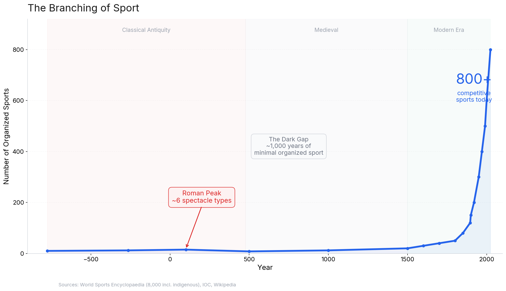
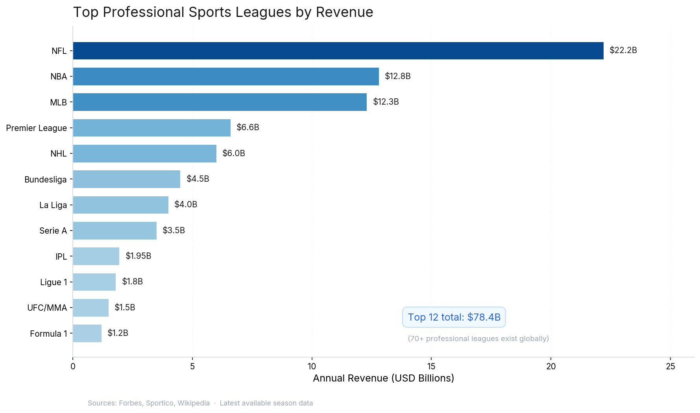
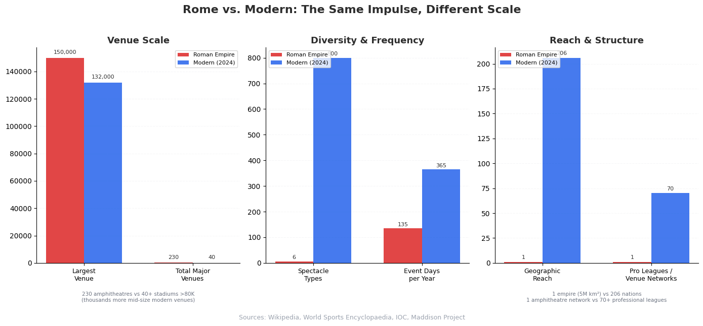
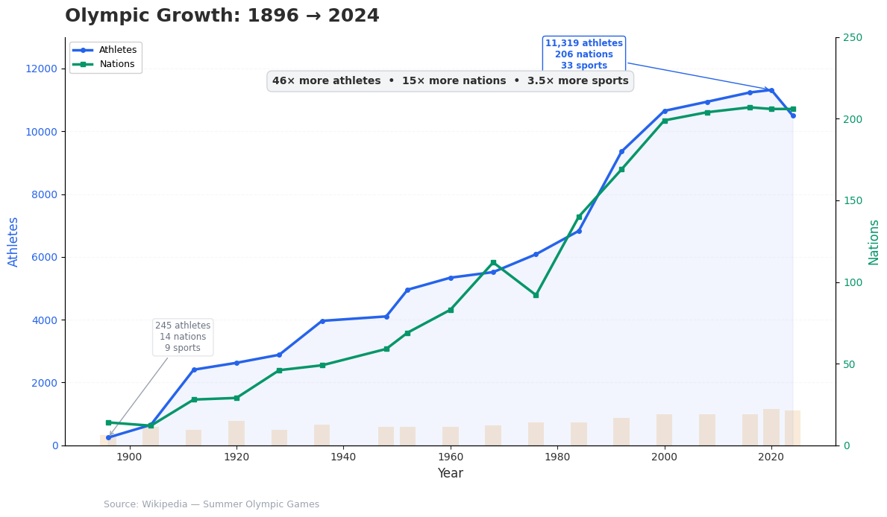

# Sports & Civilization: Can We Measure Progress by How We Play?

> In 2024, the global sports industry generated $2.65 trillion in revenue. The entire Roman Empire's GDP was roughly $77 billion in today's dollars. The NFL alone now out-earns ancient Rome.

> Something happened between gladiators fighting to the death in the Colosseum and Lionel Messi scoring in front of a billion screens. Species diversity is how biologists measure ecosystem health. Sports diversity might measure civilizational health.

---

The evolution of sport, from Roman gladiatorial combat to today's global industry, is one of the most underappreciated metrics of societal advancement. Not because sports themselves are a sign of progress, but because the *way* a civilization organizes its spectacle reveals what it values: coercion or choice, violence or skill, state control or individual agency.

The Romans had spectacle at an extraordinary scale. The Circus Maximus seated 150,000, larger than any stadium on Earth today. The state funded 135 days of public games per year. Emperor Trajan (98-117 AD) once staged 123 consecutive days of games featuring 10,000 gladiators and 11,000 animals. By any measure, Rome took entertainment seriously.

But today, there are over 800 recognized competitive sports. The 2024 Paris Olympics featured 32 sports, 329 events, and 10,500 athletes from 206 nations, nearly half of them women. The Romans had roughly six categories of spectacle, performed mostly by slaves, in one empire.

The question isn't whether we have *more* sports. It's whether the branching from a handful of violent spectacles into thousands of voluntary, diverse, commercially viable competitions tells us something real about how far we've come.

---

## The Modern Colosseum

The numbers are almost absurd.

The global sports industry is worth an estimated $2.65 trillion [1]. That's roughly 2.5% of global GDP, an entire sector of the world economy dedicated to organized play.

Just twelve professional leagues generate $78 billion in annual revenue [2]. The NFL leads at $22.2 billion. The NBA pulls in $12.8 billion. The English Premier League earns $6.6 billion by kicking a ball around a grass rectangle. Even cricket's Indian Premier League, a league that didn't exist before 2008, generates nearly $2 billion a season.

And these are just the professional leagues. Below them sit college athletics, amateur leagues, recreational sports, fitness industries, sports betting ($200+ billion globally) [3], sports media, fantasy sports, and the newest branch of all: esports, which has 454 million viewers and is getting its own Olympic Games in 2027 [4].

The infrastructure is staggering. Over 40 stadiums worldwide seat more than 80,000 people [5]. India's Narendra Modi Stadium holds 132,000 for cricket. Ten stadiums exceed 100,000 capacity. Hundreds more seat 40,000 or above. Unlike ancient venues, these are spread across every inhabited continent, from Ahmedabad to Ann Arbor, from Johannesburg to Kuala Lumpur.

But the real revolution isn't the venues. It's broadcasting.

The first sports broadcast was in 1899, when Marconi telegraphed the America's Cup from New York Harbor [6]. The first radio sports broadcast came in 1921 (a boxing match in Pittsburgh). The first live TV sport in 1931 (the Epsom Derby). Since then, sports have been the killer app for every new media technology: radio, television, color TV, cable, satellite, streaming. A single FIFA World Cup final now reaches an estimated audience in the hundreds of millions [7]. The Circus Maximus held 150,000 people, an impressive feat of engineering. A World Cup final reaches *a thousand times* that number, simultaneously, across 200 countries.

Then there's what modern sports offer that Rome never could: **choice**. The World Sports Encyclopaedia counts 8,000 known indigenous sports and games worldwide [8]. The 2024 Olympics alone featured 32 sports, from archery to wrestling, skateboarding to surfing, breaking to sport climbing. You can watch, play, or bet on virtually any physical (or digital) competition you can imagine. The diversity is the point.

---

## Blood and Bread

Now rewind 2,000 years.

At its peak, the Roman Empire had roughly 55 million people spread across 5 million square kilometers, an area slightly larger than the modern European Union [9]. Rome itself held about a million residents, making it one of the largest cities the world had ever seen.

The Romans didn't have "sports" the way we understand them. They had *spectacle*, public entertainment so deeply woven into governance that neglecting it could bring down an emperor. The poet Juvenal (early 2nd century AD) coined the phrase *panem et circenses*, "bread and circuses," as a sardonic summary of how Rome kept its people in line [10]. Emperor Tiberius (14-37 AD) acknowledged the grain supply and public games as an imperial duty, warning that neglecting them would cause "the utter ruin of the state."

This wasn't entertainment. It was infrastructure.

During the Imperial era, **135 days per year** were designated as public holidays for *ludi*, state-funded games that included gladiatorial combat, chariot racing, beast hunts, theatrical performances, and athletic contests [11]. More than a third of the year dedicated to spectacle, and attendance was free.

The venues rivaled anything we've built since. The Circus Maximus measured 621 meters long and seated an estimated 150,000 spectators [12]. That's larger than any modern stadium. The Colosseum (80 AD), built with spoils from the siege of Jerusalem, held 50,000 to 80,000 and hosted gladiatorial combat, beast hunts, mock naval battles, and public executions [13]. Across the empire, archaeologists have identified roughly 230 amphitheatres, a network of entertainment infrastructure stretching from Britain to North Africa [14].

The economics were staggering. Augustus (27 BC - 14 AD), in his personal autobiography (the *Res Gestae*), proudly listed his spending on gladiatorial spectacles among his key achievements [15]. He spent 600 million denarii from his personal fortune on public projects. In modern terms, that's roughly $2.4 to $6 billion in purchasing power [16], or about 7% of the Roman state's annual revenue, spent from *one man's personal wealth*. Imagine a modern president spending hundreds of billions of their own money on public entertainment. The comparison has no equivalent because no modern leader's personal fortune represents that share of their nation's economy.

Individual events could be lavish beyond imagination. Trajan's Dacian victory celebration (108-109 AD) ran for 123 consecutive days with 10,000 gladiators and 11,000 animals [17]. Julius Caesar (65 BC), while carrying enormous personal debt, deployed 320 gladiator pairs in silvered armor for a single *munus*, so many that the Senate imposed a cap out of fear he was building a private army [18].

The gladiators themselves were a paradox. Most were slaves, prisoners of war, or condemned criminals. Yet by the late Republic, an estimated half were paid volunteers [19]. Top performers were celebrities. Tiberius offered retired gladiators 100,000 sesterces each to return. Nero (54-68 AD) gave his favorite gladiator, Spiculus, property "equal to those of men who had celebrated triumphs" [20]. The gladiator schools, four operated near the Colosseum alone, were proto-sports academies: full-time residence, specialized coaching by *doctores*, public training sessions with 3,000-seat practice arenas, and career management by *lanistae* [21].

But here's the crucial difference: **the performers had no choice**.

The Isidore of Seville classification recognized four categories of Roman spectacle: *gymnicus* (athletic), *circensis* (chariot racing), *gladiatorius* (gladiatorial combat), and *scaenicus* (theatrical) [22]. Adding beast hunts and mock naval battles, Rome offered roughly six types of entertainment. Six categories, funded by the state, performed largely by the coerced, for a thousand years.

---

## The Parallel

The human impulse is constant. A 2012 peer-reviewed study applied modern sports consumer theory to Roman spectators and found the patterns identical: experience, community, social identity, and socializing, the same reasons people watch the Super Bowl today [23]. The Romans were us. They just had fewer options and less freedom.

Here's what changed.

**Coercion became choice.** This is the most important shift. Roman spectacle depended on enslaved performers and state-mandated holidays. Modern sports depend on voluntary athletes and audiences who choose to engage. LeBron James has earned over $1 billion in his career and can walk away whenever he wants. A Roman gladiator, no matter how famous, was legally property.

**Monopoly became diversity.** Six spectacle types became 800+ sports. This branching reflects a society wealthy enough, free enough, and creative enough to support thousands of forms of competitive expression. The 1896 Olympics had 9 sports and 241 athletes. The 2024 Olympics had 32 sports and 10,500 athletes. That 46x growth in participation isn't just about population. It's about *access*.

**State cost became commercial value.** Spectacle went from a governance expense, alongside the grain dole, to one of the most valuable commercial sectors on Earth. When entertainment stops being something the state *must* provide to prevent unrest, and becomes something people voluntarily spend $2.65 trillion on, the underlying economy has fundamentally matured.

**Local became global.** 230 amphitheatres in one empire became sports broadcast to 206 nations. The infrastructure of shared experience went from stone and sand to fiber optics and satellites. A kid in Lagos and a kid in Leipzig can watch the same goal at the same millisecond. Rome could never have imagined this.

**Exclusion became inclusion.** At the 1896 Olympics, zero women competed. By 2020, nearly half of all Olympic athletes were women [24]. That single statistic captures more about civilizational progress than any revenue figure.

---

## What This Means

So can we actually measure civilizational progress by how we play?

The branching of sport tracks every major marker of advancement: economic growth (sports as 2.5% of global GDP), individual liberty (athletes as free agents, not slaves), gender equality (from zero to 50% women in the Olympics over 128 years), global cooperation (206 nations competing under shared rules), and technological innovation (every new media technology, from radio to streaming, was accelerated by sports).

But this isn't a story about sports getting "better." It's about what the structural shifts reveal. The Romans built the Colosseum in ten years and staged spectacles that make modern event planning look modest. Their engineering was extraordinary, their logistics of importing exotic animals from three continents astonishing, their legal frameworks governing gladiator ownership sophisticated. Dismissing that as "primitive" while ignoring the concussion crisis in the NFL or the sportswashing of authoritarian regimes through mega-events would be dishonest.

What *is* different, irreducibly, are five things:

1. **Who performs.** Slaves became free agents.
2. **Who pays.** The state became the market.
3. **Who watches.** One city became 206 nations.
4. **Who plays.** Men became everyone.
5. **How many ways.** Six became eight thousand.

Each of these shifts mirrors a broader civilizational transition, from coercion to consent, from scarcity to abundance, from local to global, from exclusion to inclusion. Sports didn't cause these transitions. But they reflect them with unusual clarity, because spectacle is one of the few human activities that every civilization, without exception, has practiced.

Augustus (27 BC - 14 AD) spent the equivalent of billions from his personal fortune on public spectacle and listed it as one of his greatest achievements. He had to. The games were infrastructure, as essential as roads and aqueducts. Two thousand years later, the sports industry generates $2.65 trillion without a single emperor's involvement. It sustains itself because billions of free people choose it.

That's the measure. Not the size of the stadium, but who gets to walk in, who gets to compete, and whether anyone is forced to be there.

---

### Sources

[1] Howard & Best, "Just How Big Is the Sports Industry?" *Sportico*, 2025.
[2] Wikipedia, "List of professional sports leagues by revenue."
[3] Wikipedia, "Sports betting." Estimated global market $200B+.
[4] Wikipedia, "Esports." 454M viewers (2020 est.), Olympic Esports Games planned for 2027.
[5] Wikipedia, "List of stadiums by capacity."
[6] Wikipedia, "Broadcasting of sports events."
[7] Wikipedia, "List of most-watched television broadcasts." Note: global figures routinely exaggerated; independent analysis suggests few broadcasts reach 1B.
[8] *World Sports Encyclopaedia* (2003). 8,000 indigenous sports and games.
[9] Wikipedia, "Roman Empire." Population 56.8M (25 BC census); territory 5M km² at peak.
[10] Wikipedia, "Cura annonae." Juvenal's *panem et circenses.*
[11] Wikipedia, "Ludi." 135+ days of state-funded games in the Imperial era.
[12] Wikipedia, "Circus Maximus." 621m × 118m, 150,000+ capacity.
[13] Wikipedia, "Colosseum." 50,000-80,000 capacity; built 70-80 AD.
[14] Bomgardner, *The Story of the Roman Amphitheatre* (2000). ~230 amphitheatres.
[15] Wikipedia, "Res Gestae Divi Augusti." Augustus' personal account of expenditures.
[16] Derived estimate. 600M denarii = 2.4B sesterces. At 1-2.50 USD purchasing power per sesterce: $2.4-6B. Annual state revenue under Augustus estimated at ~800M-1B sesterces.
[17] Wikipedia, "Gladiator." Trajan's Dacian celebration: 10,000 gladiators, 11,000 animals, 123 days.
[18] Wikipedia, "Gladiator." Caesar's 320 pairs in silvered armor; Senate imposed citizen cap.
[19] Wikipedia, "Gladiator." ~50% paid volunteers by late Republic.
[20] Wikipedia, "Gladiator." Tiberius' 100K sesterces offer; Nero's gift to Spiculus.
[21] Wikipedia, "Ludus Magnus." 4 schools, 3,000-seat training arena.
[22] Wikipedia, "Ludi." Isidore of Seville's four-category classification.
[23] Minowa & Witkowski, "Spectator consumption practices at the Roman games," *Journal of Historical Research in Marketing* 4(4), 2012.
[24] Wikipedia, "Summer Olympic Games." 2020 Tokyo: ~48% women athletes.

---

*Full source annotations: [sources-roman.md](data/sources-roman.md) · [sources-modern.md](data/sources-modern.md) · [sources-bridge.md](data/sources-bridge.md) · [facts.csv](data/facts.csv)*
